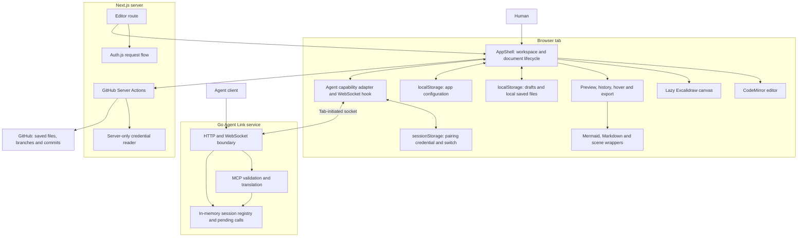
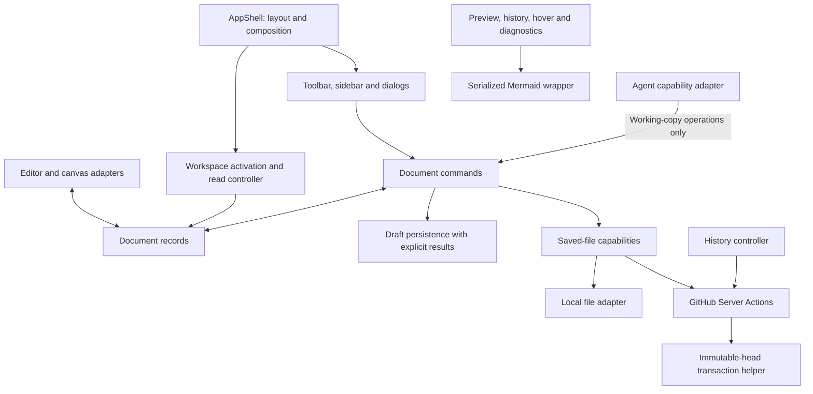

# Architecture model and refactor review

Architecture review and staged implementation record; accepted product behavior
is unchanged unless an owning ADR records the decision.
Stages 1–10 have been implemented. Browser acceptance for stages 4–10 remains a
manual check; Stage 10's browser and live Agent Link matrix is intentionally left
for separate verification.

The architecture is appropriate for the product: a browser working copy over GitHub commits or local saved files, plus an optional Go relay. The necessary refactor is to make document identity, revision, persistence, and asynchronous completion explicit. Splitting large components alone will not address the observed failures.

**Sequence decision:** finish the document-owner and `AppShell` refactor before adding
workspace-oriented MCP tools or changing the relay protocol. The existing Agent Link
surface remains available throughout the refactor. A lighter shell is an architectural
exit condition, not merely a shorter file: it must compose the UI and call narrow
controllers, while one document owner handles working-copy state and commands.

## Current architecture



| Responsibility | Current owner | Assessment |
|---|---|---|
| Authentication and credential refresh | `app/auth.ts`, `app/proxy.ts`, `app/lib/session.server.ts` | Clear boundary; keep credentials and refresh on the server |
| GitHub file operations | `app/app/actions/github.ts` | Correct placement; multi-step writes need consistent snapshots |
| Working-copy lifecycle | `app/components/AppShell.tsx` | Principal coupling point: navigation, persistence, save, rename, deletion, history, agent commands and UI |
| Local saved files and drafts | `app/lib/storage.ts` | Compact API, but content failures and missing files are conflated |
| Text editor | `app/components/Editor.tsx` | Reuses one view, but does not isolate documents' history or reconcile by identity |
| Rendering and export | `mermaid.ts`, `markdown.ts`, `export.ts`, `exportScene.ts`, client surfaces | Useful seams; shared Mermaid initialization needs coordination |
| Scene operations and comparison | `sceneEdit.ts`, `sceneLint.ts`, `excalidraw.ts` | Cohesive domain functions; retain semantic scene equality |
| Agent transport | `agentLink.ts`; Go `httpapi`, `tools`, `session`, `protocol` | Sensible package boundaries; browser document commands lack mutation ordering |
| Tests and delivery | App wire fixtures; Go service tests; `.github/workflows/mcp.yml` | Stronger service checks than document-lifecycle coverage |

`AppShell` is 3,142 lines, `Editor` 1,284, `sceneEdit` 878, and Go `tools.go` 822. The risk is shared mutable responsibility, not a line-count threshold. The latter two large modules are more cohesive than the shell.

The implicit document model is:

```text
Workspace = Local | GitHub(owner, repository, branch) | Unselected
Document  = Scratch(kind) | File(workspace, path)
Saved     = Missing | Local(content) | GitHub(content, blobSha)
Working   = Active editor content | Background draft | Saved content
```

Only the active document has `baseline` and `loadedSha`. A background draft stores `content` and `updatedAt`. Meanwhile `createdPaths`, `pendingPaths`, `dirtyPaths`, the saved tree, and draft keys all describe overlapping aspects of document existence. Operations must keep these representations synchronized manually.

## Findings that should drive the work

P1 means prioritize because work can be lost, overwritten, or applied to the wrong document. P2 means a correctness or maintenance fix that can follow or ship independently. “Reproduced” below means local execution; mocked external boundaries are named explicitly. Browser interaction and live GitHub behavior were not reproduced.

### 1. P1 — GitHub validation and commits observe different branch snapshots

**Reproduced with the actual action functions and a mock API.** [GitHub actions](../app/app/actions/github.ts): `commitFiles`, lines 512–547; `renameFile`, lines 401–413.

Save All validates blob SHAs using the branch name, then fetches the head commit. A competing edit between those reads can become the parent of a commit containing stale user content. Non-forced ref advancement does not help when the stale write is explicitly based on the newer head. Rename reads its source before its parent in the same way.

Capture the branch head first, validate/read at that immutable commit, build on its tree, and advance the ref without force. A subsequent competing commit should make advancement fail. Share this server-only mechanism across multi-file mutations. This repairs the conflict-protection intent of [ADR 0003](adr/0003-branch-model-and-no-force-push.md).

### 2. P1 — Async completion can change an unrelated active document

**Source trace.** [AppShell](../app/components/AppShell.tsx): `refreshTree` 636, `openFile` 1015, `commitCurrent` 1779, Save All completion 1989, `selectVersion` 2104.

Save All captures `openPath`. If A is open at submission and B is opened before completion, A's returned content and SHA are installed as B's baseline. Single Save checks a live path ref, but identical paths in different branches/repositories still compare equal. Tree and file reads lack a shared request-generation guard, so an earlier slow request can replace a newer selection.

Capture full workspace/document identity and a request or activation generation. Settle a write against its original document record; update the active view only if it still owns that identity. A remote commit that already succeeded must still be recorded even if its UI activation was superseded.

### 3. P1 — Draft durability depends on preview debounce and incidental navigation paths

**Source trace.** [AppShell](../app/components/AppShell.tsx): autosave 803–808, scratch switching 918–932, named-file and scratch-save completion 1798–1844; [hook](../app/lib/hooks.ts): 6–22.

Persistence writes `debouncedText`. Edit A and switch quickly to B: changing the debounce key cancels A's pending timer, while there is no common flush of A's latest live content. The correct key prevents cross-file contamination but does not retain the outgoing edit.

Related inconsistencies: scratch switching saves clean templates unconditionally; saving a named file clears the parked scratch slot even though it did not consume that scratch document. These conflict with the dirty-only and document-specific draft intent in ADRs 0006/0014.

Keep current working content synchronously in a document record. Separate preview debounce from persistence. Flush an outgoing dirty draft before activation changes, retain it on failure, and consume a scratch draft only when that exact scratch revision was promoted successfully.

Also cover **empty never-saved files**: they use an empty baseline, so empty content can become “clean” and lose its only persisted existence record. File existence must not be inferred solely from content inequality.

### 4. P1 — Storage failures and destination collisions can destroy content

**Reproduced against storage functions; human creation and GitHub destination handling also source-traced.** [Storage](../app/lib/storage.ts): `renameLocalFile` 247, `saveDraft` 272; [AppShell](../app/components/AppShell.tsx): human creation 1526, rename 1576, draft move 1644–1649, local Save All 1925.

- Renaming local A onto B returns success, replaces B, and removes A. GitHub rename creates the destination tree entry without checking for an existing file. Pending-file rename can overwrite another draft.
- The draft move calls `saveDraft(new)` then `clearDraft(old)`. A failed destination write is swallowed, so both copies can be absent afterward.
- Human New File checks path syntax but not existing saved/pending content before replacing the draft with a template.
- Local Save All removes every attempted path from `createdPaths`, including failed writes. A failed background new file can disappear from the current sidebar.
- Accessing the storage property itself can throw before the surrounding methods reach their `try` blocks; the local write function then throws instead of returning failure.

Use explicit results for content reads/writes/moves/deletes; distinguish absence, invalid data, and unavailable storage. Delete the source only after the destination is durably written. Reject create/move collisions across saved and pending documents, including authoritative GitHub checks at the captured head. Settle only successful paths.

### 5. P1 — Agent mutations can race other commands and human edits

**Source trace.** [Agent transport](../app/lib/agentLink.ts): 285; [AppShell](../app/components/AppShell.tsx): `resolveTarget` 1146, `writeBack` 1232, `sceneEdit` 1449.

Each incoming request starts independently. A scene command captures `open: true`, awaits scene operations, then writes through `setText` using that old flag. Navigating to a different document during the wait can put scene JSON into the new document. Concurrent background operations can read the same draft and later overwrite one another. Render-fresh capability closures do not protect an operation already in flight.

Route human and agent working-copy mutations through shared document commands. Serialize conflicting mutations per document and verify the working revision before applying asynchronously computed results. Use revision conflict/retry or reapply validated operations to the latest content. The next command must observe an acknowledged mutation without waiting for React to render.

`openFile` also needs a structured result: its current failed-read branch toasts and returns normally, allowing an agent open request to appear successful.

### 6. P1 — CodeMirror treats file switching as an undoable text edit

**Reproduced with installed CodeMirror state/history packages using the same replacement transaction; UI path source-traced.** [Editor](../app/components/Editor.tsx): `history()` 298, external-value reconciliation 947–963.

Switching text files dispatches an ordinary full-document replacement into the same history. Undo restores the previous file's content. The editor also tracks recently emitted strings without document identity, so content equality can confuse a real external change with a stale echo.

Preserve the single `EditorView`, but switch document-specific `EditorState`/history/selection using full document identity. Distinguish activation, an acknowledged editor revision, and a deliberate programmatic edit. Keep deliberate edits/reverts undoable. Update ADR 0005 to specify the history lifetime, including leaving text mode or entering Diff.

### 7. P2 — Mermaid configuration is mutable global state across async callers

**Reproduced with the actual wrapper and mock renderer/font wait.** [Mermaid wrapper](../app/lib/mermaid.ts): `renderToSvg` 172 and `parseDiagram` 235.

Configuration is applied before awaiting fonts and rendering. Concurrent requests for default and dark themes both reached the mock renderer with dark configuration. Main preview, history, hover, embedded diagrams, and diagnostics all share this boundary.

Serialize configuration plus parse/render lifecycle in the wrapper. A library's internal rendering queue cannot protect initialization performed outside it. Suppress stale UI adoption separately from renderer cleanup.

The ELK workaround changes global `JSON.stringify` during asynchronous rendering. Its depth guard restores it, but other browser code observes the replacement meanwhile. Keep the workaround isolated and regression-tested; evaluate removing it only after verifying the original upstream failure no longer occurs.

### 8. P2 — History pagination omits records

**Reproduced with the actual action and mock paginated API.** [GitHub actions](../app/app/actions/github.ts): `listFileCommits` 279–305.

A 30-row page fetches 32 raw records on page 1 and 31 on page 2. Page 1 returns records 1–30; page 2 starts at record 32. Commit 31 is skipped, and later surplus records are also discarded.

Separate upstream pagination from display pagination. Keep a stable upstream page size and preserve surplus records, or carry an explicit continuation offset. Cover rename filtering and exactly-once history traversal. This small fix can ship independently of the document refactor.

### 9. P2 — Multi-file deletion has an incomplete success contract

**Source trace.** [GitHub actions](../app/app/actions/github.ts): `deletePaths` 354; [AppShell](../app/components/AppShell.tsx): `confirmDelete` 1695.

Deletion commits each path independently. If a later path fails, the action returns only an error, losing the list already deleted. The client exits without reconciling the sidebar/drafts. Retry may fail immediately on an already-deleted path because its SHA read throws 404.

Prefer an atomic deletion commit built on the snapshot helper, or preserve partial outcomes explicitly. Atomic deletion would be a deliberate behavior change, not a requirement inherited from Save All. Local deletion should also report failures instead of claiming success after a swallowed remove error.

### 10. P2 — Original draft baselines disappear when a file becomes background work

**Source trace; accepted design limitation, not undocumented drift.** [Storage](../app/lib/storage.ts): `Draft`; [AppShell](../app/components/AppShell.tsx): `openFile`, background Save All reads; [ADR 0003](adr/0003-branch-model-and-no-force-push.md).

Drafts retain content/time but no original base SHA. Reopening or saving a background draft obtains the current remote SHA and pairs it with older local edits. A remote edit since drafting may therefore be overwritten without a conflict, even after finding 1's server race is fixed.

Persist a versioned draft envelope with its original saved revision. Preserve that base while dirty. Treat drafts without a recorded base as **unknown**; do not silently label them current. This needs an explicit reconciliation flow and ADR updates. It is a separate problem from the server check/head ordering race.

### 11. P2 — Verification does not protect the main refactor surface

The checked-in app tests contain one file and 31 wire-fixture tests. The only checked-in workflow targets MCP/protocol paths and does not generally gate application typecheck/build. `npm run lint` fails with an invalid `app/lint` directory before evaluating rules.

Repair the lint command/configuration and add general app CI. Add deterministic tests around persistence, transaction ordering, document activation and mutation settlement, plus a small browser suite for history, navigation and editor integration. Retain the literal protocol fixtures. Passing the current suite is not evidence that document lifecycle behavior is safe.

## Other smells and boundaries to preserve

| Observation | Recommendation |
|---|---|
| Independent React state fields encode one domain transition | Establish one document owner with atomic transitions before extracting shell JSX |
| Human and agent creation/edit rules are duplicated | Share domain commands while exposing a narrower agent capability surface |
| Storage/config JSON is largely cast into expected types | Parse/version persisted envelopes at the boundary; handle corrupt records explicitly |
| Pairing-code comment says “Never a token” and calls it a name | Correct the comment to match ADR 0011's credential model; observed per-tab storage remains appropriate |
| Mobile hook comment says Tailwind `md`, but its query is 1000px | Correct misleading comments with their owning cleanup; no breakpoint redesign is justified by this review |
| Build warns on `::highlight` and unset `metadataBase` | Verify production search highlighting and set intended metadata origin; do not replace intentional highlight behavior based on a parser warning alone |

Keep GitHub as committed storage, Server Actions as its boundary, server-only tokens, request-flow refresh, compare-URL Open PR, and non-forced ref updates. Keep local mode's lack of Git capabilities explicit. Do not add a database, distributed lock, or state library solely to make the structure look cleaner.

The reviewed import sites preserve Excalidraw code splitting. The Markdown pipeline preserves render → sanitize → trusted substitution. Scene display background and serialized content remain separate. These are useful existing boundaries, not refactor targets. The Go service's HTTP/tools/session separation, limits, and protocol fixtures should also remain.

## Proposed ownership



A document record should own its full identity, kind, current content, monotonic working revision, saved baseline/revision, existence state, and persistence status. The workspace controller owns the active key and request generations. Presentation subscribes to records instead of independently maintaining competing facts about the document.

Call the document owner `WorkspaceStore` in the implementation plan. It is a
browser-side working-copy abstraction, **not** a new durable server database or a
generic replacement for the GitHub/local saved-file adapters. Its initial public
operations should be no broader than snapshot/subscribe, read, activate, and atomic
document commands. Human edits, CodeMirror transactions, background agent edits,
scene operations, and save settlement must all advance the same per-document working
revision. An asynchronous command captures identity and revision before computing,
then either applies to that revision or returns a conflict/retries against current
content. A successful command updates the owner before acknowledging the agent;
React rendering and draft persistence follow from that transition.

Important invariants:

1. A completed operation can change only the workspace/document revision it names.
2. An acknowledged mutation is visible to the next command immediately.
3. A save advances the saved baseline to submitted content, preserving any later working edits.
4. Losing storage access does not discard the only in-memory copy or report durable success.
5. Empty content and absent documents are different states.
6. New/moved destinations are checked against saved and pending files; incomplete trees do not prove absence.
7. Switching documents preserves each document's content, undo history and selection according to an explicit lifetime policy.

Start with a reducer and a small document-command layer. Keep React effects for subscriptions, rendering and persistence scheduling, rather than using effects as the only durable record of a mutation. Derive dirty/pending sets from records where possible. No generic repository interface should pretend local mode supports branches or history.

## Refactor stages

Sizes are relative review scope, not time estimates. Each correctness change should begin
with a failing regression test. A stage may use several small PRs, but each PR should leave
the application in a releasable state. The stages describe dependency order; independent
work explicitly identified below may proceed in parallel.

### Stage 1 — Establish guardrails

**Goal:** make later behavior changes observable and safe to review.

**Scope:**

- Repair the lint command and configuration so it evaluates the application.
- Add general application CI for typecheck, build, lint, and app tests.
- Add reusable controlled-promise, storage, and GitHub API fakes.
- Convert the locally reproduced failures into focused regression tests where practical.

**Keep out:** production document-state changes. Urgent correctness fixes in stages 2 and
3 do not need to wait for all CI cleanup, provided their focused tests run in the PR.

**Exit criteria:** ordinary application changes run the general checks, and later stages
can deterministically control storage failures and asynchronous completion order.

### Stage 2 — Make GitHub mutations snapshot-consistent

**Goal:** ensure validation and mutation use one immutable repository view.

**Scope:**

- Add a server-only transaction helper that captures the branch head before reading or
  validating files.
- Resolve source SHAs, destination collisions, and trees against that captured commit.
- Build the new commit from the captured tree and advance the branch with `force: false`.
- Move Save All and rename onto the helper without changing the Server Action boundary.
- Define and test the behavior of a repository with no initial commit instead of assuming
  that the current failure is supported behavior.

**Exit criteria:** a write that races before validation produces a content conflict; a
write that races after validation fails ref advancement; rename never overwrites an
existing destination; both original files remain after a rejected collision.

**Owning record:** update ADR 0003 if the transaction or initialization contract changes.

### Stage 3 — Make draft persistence lossless

**Goal:** preserve the only working copy through navigation, storage failure, and moves.

**Scope:**

- Replace ambiguous storage returns with explicit absence, invalid-data, unavailable,
  and success results.
- Make draft and local-file moves write the destination durably before deleting the source.
- Keep current content synchronously and flush an outgoing dirty document before activation.
- Separate preview debounce from persistence scheduling.
- Preserve failed new-file paths, and settle only successful Local Save All entries.
- Consume only the scratch document revision that a successful promotion actually saved.
- Represent an empty never-saved file as existing independently of whether it is dirty.
- Reject create and move collisions across saved and pending documents.

**Exit criteria:** rapid switching, storage quota/access failures, empty new files, failed
background saves, pending-file moves, and parked scratch documents do not lose content or
report false durability.

**Owning records:** update ADRs 0001, 0004, 0006, and 0014 as their persistence and
document-existence contracts become explicit.

### Stage 4 — Introduce document identity and guarded settlement

**Goal:** make every asynchronous result settle against the document and workspace that
started it.

Implement this large stage through small PRs in this order:

1. Define full workspace and document keys, including repository and branch identity.
2. Introduce `WorkspaceStore` document records with content, working revision, saved baseline/revision,
   existence, and persistence status.
3. Add a reducer or equivalent atomic transition owner and derive dirty/pending state from
   records where possible.
4. Add activation and request generations to file, tree, history, and save operations.
5. Settle successful writes into their original record, updating the active view only when
   it still owns that identity and generation.

Stage 3 is a prerequisite; integrate the snapshot semantics from stage 2 for GitHub saves.

**Exit criteria:** tests reverse the completion order of file, tree, history, single-save,
and Save All promises without crossing state. Identical paths in different repositories or
branches remain distinct. A successful remote commit is recorded even after its UI request
is superseded, and later edits remain newer than the submitted saved baseline.

**Owning records:** update ADRs 0001, 0004, 0006, and 0014.

### Stage 5 — Route mutations through shared commands

**Goal:** give human actions, agent actions, and editor adapters one ordered working-copy
mutation path.

**Scope:**

- Introduce document commands for open, create, edit, write, scene edit, save, rename, and
  delete, while retaining a narrower agent capability surface.
- Serialize conflicting mutations per document.
- Attach expected working revisions to asynchronous computations and reject, retry, or
  safely reapply them against newer content.
- Return structured success/failure from open and other commands.
- Ensure an acknowledged command updates the document record before the next command runs,
  without waiting for a React render.
- Keep the current MCP tool names, arguments, results, pairing flow, and frame contract.
  Adapt their browser capabilities to the shared commands; new discovery or patch tools
  are explicitly deferred until after stage 9.
- Preserve one CodeMirror `EditorView`, but keep `EditorState`, undo history, and selection
  per full document identity. Treat activation separately from deliberate undoable edits.
- Specify what happens to editor history when leaving text mode or entering Diff.

**Exit criteria:** chained agent edits observe prior acknowledgements; concurrent background
edits cannot overwrite each other; a delayed scene edit cannot write into a newly activated
document; switching files and pressing Undo never restores another file's text.

**Owning records:** update ADR 0005 for editor-state lifetime and ADR 0011 for command and
mutation ordering.

### Stage 6 — Move document content to IndexedDB

**Goal:** remove the roughly 5 MiB `localStorage` ceiling for local files and drafts
without weakening the stage 3 persistence guarantees.

**Decision:** start with an empty IndexedDB document store. Do not import, read through,
or delete existing `km:file:` and `km:draft:` localStorage records. Existing local
files and unsaved drafts will not appear in the new store; make that fresh-start
behavior clear before release. Keep small shared app config in `localStorage` and
Agent Link's switch and pairing code in per-tab `sessionStorage`.

Implement through small PRs in this order:

1. Define an asynchronous document-storage interface with the existing explicit
   present, missing, invalid, unavailable, quota, and collision outcomes. Keep full
   workspace/document identity in draft keys. Use separate local-file and draft
   object stores, with path listing that does not need to load every document body.
2. Open and validate the database during workspace initialization. Treat an open,
   upgrade, or blocked transaction failure as unavailable storage; do not present
   an empty workspace as proof that stored files are absent.
3. Move local-file and draft reads, writes, listings, deletes, Save All, and scratch
   slots behind the new adapter. Await transaction completion before reporting
   durability or clearing an in-memory record. Use a single transaction for
   collision-checked local moves and for related saved-file/draft changes where
   the operation must succeed together.
4. Keep live edits in `WorkspaceStore` immediately. Order persistence writes per
   document and associate them with working revisions so a delayed write cannot
   replace a newer draft. Await the outgoing dirty draft before navigation; retain
   the current document and report failure if persistence fails.
5. Exercise reload, rapid switching, concurrent agent/human edits, local Save All,
   failed or aborted transactions, quota errors, and unavailable storage in browser
   tests. Check the local-mode and GitHub-draft paths separately.

IndexedDB has a larger browser-dependent quota, not guaranteed permanent storage.
Keep quota and eviction recovery visible; consider requesting persistent storage
when local mode first saves content, and provide a local-file export/backup path
before treating browser-only files as a dependable long-term library.

Stages 4 and 5 are prerequisites: asynchronous storage needs the document owner
and ordered commands. This stage does not change GitHub committed storage or add a
server database.

**Exit criteria:** local files and drafts survive reload; transaction success means
the write completed; failed navigation, moves, and saves preserve the only working
copy; older asynchronous writes cannot overwrite newer revisions; fresh installs
start empty without reading legacy document keys.

**Owning records:** update ADRs 0001, 0004, 0006, and 0014, plus the `AGENTS.md`
storage rules, when the implementation lands.

### Stage 7 — Preserve and reconcile draft base revisions

**Goal:** prevent an old background draft from being paired silently with a newer remote
revision.

**Scope:**

- Version the draft envelope and store its original saved revision while it remains dirty.
- Treat a versioned draft whose recorded base is unknown as requiring reconciliation;
  never label it with the current remote SHA merely because it was reopened. The
  unversioned development format needs no migration because it was never released.
- Add an explicit reconciliation path for changed or unknown bases.
- Reject invalid draft envelopes without partially adopting their content.

Stages 3–6 are prerequisites because the schema depends on explicit persistence results,
document records, shared commands, and the new document store.

**Exit criteria:** a remote edit made after drafting produces a reconciliation/conflict
state instead of being overwritten silently, and invalid envelopes are not partially
adopted as working documents.

**Owning records:** update ADRs 0003, 0004, 0006, and 0014.

### Stage 8 — Land independent correctness fixes

These fixes should use separate PRs so they need not wait for the document-model work:

- **History pagination:** separate upstream page traversal from UI page size and preserve
  surplus records. Verify rename filtering and exactly-once traversal. This has no document
  refactor dependency.
- **Mermaid serialization:** serialize initialization together with parse/render and keep
  stale UI adoption separate from renderer cleanup. Retain and regression-test the ELK
  workaround until its upstream failure is shown to be gone. Update ADRs 0007, 0008, or
  0012 only if their renderer lifecycle contracts change.
- **Deletion contract:** either make multi-file GitHub deletion atomic using the stage 2
  transaction helper or return explicit partial outcomes. Make local deletion failures
  truthful. Atomic GitHub deletion therefore depends on stage 2 and requires an ADR 0003
  decision.

**Exit criteria:** history records appear exactly once, simultaneous light/dark Mermaid
requests retain their own configuration, and deletion success or failure precisely matches
the resulting saved and working state.

### Stage 9 — Extract presentation components

**Status:** implemented. `AppShell` retains workspace/document orchestration while
`AppLayout`, `AppHeader`, `WorkspaceSidebar`, `DocumentToolbar`, `DocumentSurface`,
and `AppDialogs` receive display state and intent callbacks. History request state
and pagination live in `useHistoryController`, scoped to the settled workspace and
path identity. `useAgentLinkController` owns the browser capability adapter,
`useWorkspaceTree` derives sidebar state, `useAppearanceController` derives render
configuration, and `useResizableLayout` owns pane geometry. CodeMirror extension
assembly is grouped without changing its document-state lifetime or gutter order.
Browser acceptance was intentionally not run for this stage.

**Goal:** reduce component coupling after behavior and ownership are stable.

**Scope:**

- Move shell layout, toolbar, sidebar, and dialogs into presentation components.
- Extract a history controller/hook around the settled document identity.
- Group cohesive CodeMirror extensions without moving document ownership back into effects.
- Correct nearby misleading comments and warnings only when their behavior is verified.

Stages 4–6 are prerequisites. This stage is mechanical: it must not redesign storage,
document commands, breakpoints, Markdown rendering, Excalidraw loading, or export behavior.

**Exit criteria:** extracted components receive state and commands through narrow props,
`AppShell` no longer knows the details of every document command, and the integration and
browser suites show no behavior change.

### Stage 10 — Improve the agent's workspace interface

**Status:** implemented. Agent Link protocol 7 adds a workspace manifest on
`ideate_connect`, bounded literal search, ordered ranged reads, atomic unified
patches with per-document revision expectations, and expected revisions for scene
edits. Existing tools remain available and use the same `WorkspaceStore` commands.
The relay logs request/response bytes, browser execution time, relay time, and
end-to-end latency for each forwarded call. Browser acceptance, representative
live task comparisons, and the manual end-to-end matrix remain separate checks.

**Prerequisite:** stages 3–7 and 9 have passed their exit criteria. Stage 2's immutable
GitHub snapshots and stage 7's draft-base reconciliation must also be complete before
the agent can rely on revisions for conflict-sensitive multi-file work. Do not start
this stage merely because a component was split into smaller files.

The current service already lets an agent address background files by path, receive
Mermaid diagnostics from an edit, inspect scene warnings, and see a canvas render.
Keep those advantages. The friction is the filesystem-shaped reasoning loop being
spread over `status`, `connect`, `list_files`, single-file `read`, and exact-string
`edit` calls. The WebSocket hop may add latency, but it has not been measured as the
dominant cost. Instrument call count, payload size, browser execution time, and
end-to-end latency before changing the transport.

Add a small workspace-oriented surface on top of `WorkspaceStore`, in this order.
These are the implemented names and contracts:

| MCP change | Proposed request | Proposed result and behavior |
|---|---|---|
| Extend `ideate_connect` | Existing `code` and optional agent name | After deliberate attachment, return workspace identity, active path, file kinds, sizes, working revisions, and dirty/new paths. Do not include file content. Keep unattached `ideate_status` metadata-only. |
| Add `ideate_search` | `code`, literal query, optional path globs, case sensitivity, context-line count, and result limit | Search the effective working copies, including background drafts. Return path, line, matching excerpt, and document revision. Start with literal search; add regex only with a safe execution budget. Cap scanned bytes and output, and say when results are truncated. |
| Add `ideate_read_many` | `code`, bounded list of `{ path, startLine?, endLine? }` | Return content or a line range, kind, and revision for each requested path. Preserve request order and report per-path failures explicitly. Never silently substitute committed content for a draft. Scenes continue through `ideate_scene_get`, not raw JSON by default. |
| Add `ideate_apply_patch` | `code`, workspace identity, unified diff, and expected revision for every touched path (an explicit `absent` expectation for a new file) | Atomically apply all text hunks or none to the browser working copy. Return affected paths, new revisions, compact diffs, and Mermaid/Markdown diagnostics. On a stale revision or ambiguous hunk, return the current revision and a bounded excerpt so the agent can rebase. Reject deletions, renames, scene JSON patches, and any attempt to commit. |
| Extend `ideate_scene_edit` | Existing operations plus expected scene revision | Preserve semantic element operations, warnings, and rendering. Reject stale edits before applying asynchronously computed geometry; return the new revision. Consider mixed text/scene transactions only after this contract is proven. |

All new operations require the existing attachment gate and pairing code. Revisions
must be scoped to the full workspace and document identity, not just a path that
may recur on another branch. `ideate_apply_patch` should make each changed open
text document one undoable editor transaction and make background changes visible
in the sidebar without opening them. The browser validates and acknowledges the
whole transaction; the relay must not report success when only some files changed.
Set request size, path count, scanned-byte, match count, and response size limits
at both MCP and browser boundaries.

Retain `ideate_list_files`, `ideate_read`, `ideate_edit`, `ideate_write`, and the
current scene tools during migration. Route their implementation through the same
document commands, compare real agent task traces, then deprecate redundant tools
only with a client compatibility plan. New frame shapes need fixtures and a
coordinated protocol version change where the existing ADR requires one.

The target agent loop is `connect/manifest → search or grouped read → atomic patch
with diagnostics`, rather than several guesses and single-file round trips. This
is an interface improvement even if all calls continue through the browser.

**Optional acceleration, after measurement:** an in-memory, session-scoped relay
mirror could serve reads/search without a tab round trip while the browser stays
authoritative for mutations and rendering. It must be bounded, revisioned,
re-synchronizable after disconnect, erased on session expiry, and never hold GitHub
credentials or become durable document storage. Synchronizing every repository
file eagerly would expand the relay's exposure and work; prefer a manifest with
lazy or explicitly scoped content. A filesystem sidecar for agents with local
workspace access is a still-later optional client of the same protocol, not the
source of truth. It would need bidirectional synchronization, conflict handling,
and an explicit sandbox/permission model; agents without filesystem access must
retain the MCP path. Neither option is a prerequisite for the new tool interface.

**Exit criteria:** representative multi-file tasks require fewer tool calls and
less elapsed time than the current surface; stale patches never overwrite human
edits; background drafts and empty new files remain visible; no agent action
commits, renames, or deletes saved files; renderer and scene feedback still arrives
with the mutation result. Update ADR 0011 and protocol fixtures in the same change
as any new frames, and run both app and Go checks plus the Agent Link end-to-end
matrix.

### Delivery order and verification gates

Stages 1–10 are implemented, with browser acceptance still manual where noted.
Stage 9 leaves `AppShell` as the orchestration/composition boundary required
before stage 10 adds MCP tools or a relay mirror. Stage 8's independent fixes
need not block shell extraction, but any unresolved correctness defect they expose
must not be hidden by the new agent surface.

Run the repository's app checks for every implementation stage. Add browser coverage as
soon as stage 4 introduces activation settlement, and extend it in stage 5 for editor
history and agent/human navigation races. Run the Agent Link end-to-end matrix for stage 5
and any protocol-affecting change. Run the canvas mobile/view-mode checks only when a stage
touches Excalidraw chrome. Documentation-only stage-planning edits require link and rule
review plus `git diff --check`.

Update each owning ADR in the PR that changes its decision. Proposed ownership in this
review remains a plan and does not override accepted contracts before those updates land.

## Verification and limits

| Check executed in this review | Result |
|---|---|
| `npm run typecheck` | Passed |
| `npm run build` | Passed; `::highlight` parser and `metadataBase` warnings |
| `npm --prefix app run test` | Passed: 31 tests, one protocol-fixture file |
| `go vet ./...` | Passed |
| `go test -race ./...` | Passed; package test results were cached |
| `npm run lint` | Failed before linting: `next lint` resolves a nonexistent `app/lint` project directory |
| Local reproduction harness | Eight assertions/scenarios reproduced the documented behaviors |

The temporary harness at `/private/tmp/keep-mermaid-audit.cjs` transpiled the actual TypeScript modules with installed TypeScript and controlled external dependencies. It exercised local rename replacement, failed draft move, throwing storage access, Save All read/head ordering, rename read/head ordering and lack of a destination read, history pagination, installed CodeMirror undo, and Mermaid config interleaving. It used fake credentials and no remote writes. The draft-move and editor transactions reproduce the source sequences rather than mounting React components.

No full-browser reproduction, live GitHub verification, Agent Link end-to-end matrix,
representative live task benchmark, canvas mobile/view-mode check, dependency
vulnerability scan, or runtime performance profile was performed. These remain
necessary acceptance work for the corresponding implementation slices. This is a
targeted architecture/correctness review, not an exhaustive security or performance
certification.
